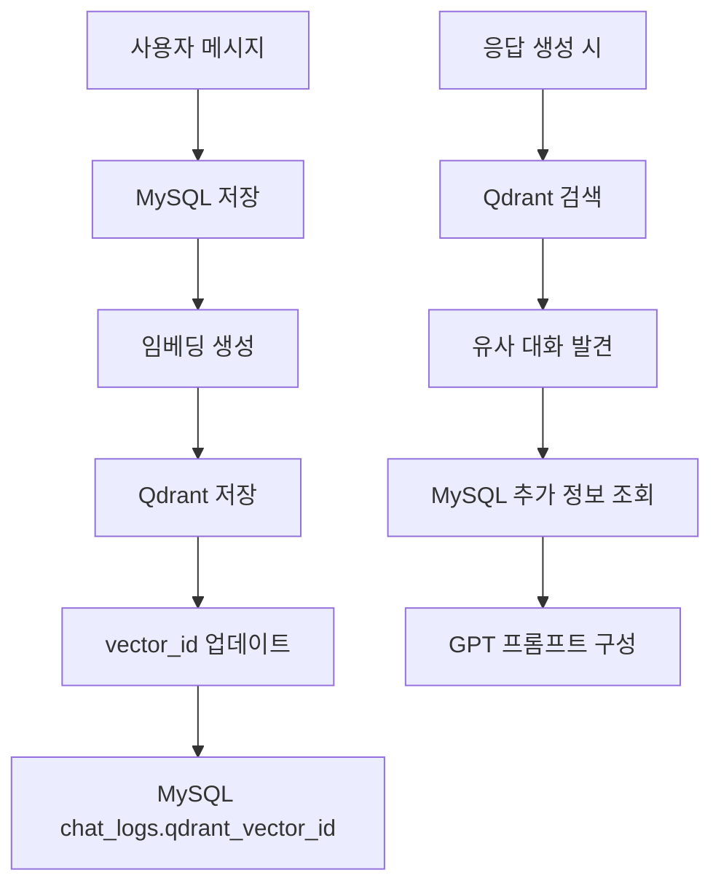

# 🎯 Qdrant 벡터 데이터베이스 아키텍처

고령층 개인화 챗봇 서비스의 Qdrant 벡터 데이터베이스 설계 및 구현 가이드

---

## 📋 목차

1. [개요](#개요)
2. [컬렉션 구조](#컬렉션-구조)
3. [데이터 모델](#데이터-모델)
4. [검색 전략](#검색-전략)
5. [MySQL 연동](#mysql-연동)
6. [성능 최적화](#성능-최적화)
7. [사용 예시](#사용-예시)

---

## 🎯 개요

### 목적
- **대화 맥락 유지**: 사용자별 과거 대화 내용을 의미 기반으로 검색
- **개인화 응답**: 유사한 상황의 이전 대화를 참고하여 자연스러운 응답 생성
- **감정 연속성**: 감정 상태 변화를 추적하여 일관된 정서적 지원

### 기술 스택
- **Qdrant**: 벡터 데이터베이스 (코사인 유사도 기반)
- **OpenAI Embeddings**: text-embedding-ada-002 (1536차원)
- **Python**: qdrant-client, pydantic

---

## 🏗️ 컬렉션 구조

### chat_vectors 컬렉션

```python
{
    "collection_name": "chat_vectors",
    "vectors_config": {
        "size": 1536,           # OpenAI 임베딩 차원
        "distance": "Cosine"    # 코사인 유사도
    }
}
```

### 벡터 포인트 구조

```python
{
    "id": "uuid-string",        # 고유 벡터 ID
    "vector": [0.1, 0.2, ...], # 1536차원 임베딩
    "payload": {               # 메타데이터
        "user_id": 1,
        "mysql_chat_id": 123,
        "role": "user",
        "message": "오늘 기분이 우울해요",
        "emotion": "우울",
        "created_at": "2024-01-15T10:30:00",
        # ... 기타 메타데이터
    }
}
```

---

## 📊 데이터 모델

### ChatVectorPayload 구조

| 필드 | 타입 | 설명 | 예시 |
|------|------|------|------|
| `user_id` | int | 사용자 ID | 1 |
| `mysql_chat_id` | int | MySQL 대화 로그 ID | 123 |
| `role` | str | 발화 주체 | "user", "bot" |
| `message` | str | 대화 내용 | "오늘 기분이 우울해요" |
| `created_at` | datetime | 생성 시간 | 2024-01-15T10:30:00 |
| `session_id` | str | 세션 ID | "session_001" |
| `emotion` | str | 감정 태그 | "우울", "기쁨", "화남" |
| `emotion_score` | float | 감정 점수 | -0.6 ~ 0.8 |
| `message_type` | str | 메시지 유형 | "text", "button", "medication" |
| `conversation_turn` | int | 대화 순서 | 1, 2, 3, ... |
| `user_age` | int | 사용자 나이 | 65 |
| `user_speech_style` | str | 말투 스타일 | "친근하고 따뜻한 말투" |
| `interest_tags` | List[str] | 관심사 태그 | ["가족", "건강"] |

---

## 🔍 검색 전략

### 1. 유사 대화 검색

```python
# 현재 사용자 발화와 유사한 과거 대화 검색
search_results = await client.search_similar_conversations(
    query_embedding=current_embedding,
    user_id=1,
    limit=5,
    score_threshold=0.7,
    filters={
        "emotion": "우울",
        "date_range": (start_date, end_date)
    }
)
```

### 2. 감정 기반 필터링

```python
# 특정 감정 상태의 대화만 검색
filters = {
    "emotion": "우울",
    "message_type": "text"
}
```

### 3. 시간 범위 필터링

```python
# 최근 7일 이내 대화만 검색
from datetime import datetime, timedelta

filters = {
    "date_range": (
        datetime.now() - timedelta(days=7),
        datetime.now()
    )
}
```

---

## 🔗 MySQL 연동

### 데이터 동기화 전략



### 연동 코드 예시

```python
# 1. MySQL에 대화 저장
chat_log = await save_chat_to_mysql(user_id, message, role)

# 2. 임베딩 생성
embedding = await generate_embedding(message)

# 3. Qdrant에 벡터 저장
payload = ChatVectorPayload(
    user_id=user_id,
    mysql_chat_id=chat_log.id,
    role=role,
    message=message,
    # ... 기타 필드
)
vector_id = await qdrant_client.add_chat_vector(embedding, payload)

# 4. MySQL에 vector_id 업데이트
await update_chat_log_vector_id(chat_log.id, vector_id)
```

---

## ⚡ 성능 최적화

### 1. 인덱싱 전략

```python
# 자주 사용되는 필터 필드에 인덱스 생성
index_fields = [
    "user_id",      # 사용자별 검색
    "emotion",      # 감정별 검색
    "created_at",   # 시간 범위 검색
    "message_type"  # 메시지 유형별 검색
]
```

### 2. 검색 최적화

```python
# 검색 결과 개수 제한
DEFAULT_SEARCH_LIMIT = 10
MAX_SEARCH_LIMIT = 50

# 유사도 임계값 설정
SIMILARITY_THRESHOLD = 0.7
```

### 3. 배치 처리

```python
# 여러 벡터를 한 번에 추가
points = [
    PointStruct(id=id1, vector=vec1, payload=payload1),
    PointStruct(id=id2, vector=vec2, payload=payload2),
    # ...
]
client.upsert(collection_name="chat_vectors", points=points)
```

---

## 💡 사용 예시

### 1. 대화 맥락 활용

```python
# 사용자: "오늘도 우울해요"
# 시스템: 유사한 과거 대화 검색

search_results = await client.search_similar_conversations(
    query_embedding=current_embedding,
    user_id=1,
    filters={"emotion": "우울"}
)

# 검색 결과:
# - "어제도 우울하다고 하셨죠" (점수: 0.85)
# - "손녀가 오면 기분이 좋아진다고 하셨어요" (점수: 0.78)

# GPT 프롬프트에 포함:
# "사용자가 계속 우울감을 표현하고 있습니다. 
#  이전에 손녀 이야기를 하면 기분이 좋아진다고 하셨으니 
#  그 방향으로 대화를 유도해보세요."
```

### 2. 약 복용 패턴 분석

```python
# 약 복용 관련 대화 검색
medication_conversations = await client.search_similar_conversations(
    query_embedding=medication_embedding,
    user_id=1,
    filters={"message_type": "medication"}
)

# 패턴 분석:
# - "혈압약 깜빡했어요" (빈도: 주 2회)
# - "약 먹는 시간이 헷갈려요" (빈도: 주 1회)
```

### 3. 감정 변화 추적

```python
# 최근 감정 변화 조회
emotion_history = await client.get_user_conversation_history(
    user_id=1,
    days=30
)

# 감정 트렌드 분석
emotions = [conv.payload.emotion for conv in emotion_history]
# ["우울", "우울", "평온", "기쁨", "우울", ...]
```

---

## 🛠️ 설치 및 실행

### 1. Qdrant 서버 실행

```bash
# Docker로 Qdrant 실행
docker run -p 6333:6333 qdrant/qdrant
```

### 2. Python 의존성 설치

```bash
pip install qdrant-client pydantic openai
```

### 3. 컬렉션 초기화

```python
from database.qdrant_schema import initialize_qdrant_collections

# 컬렉션 생성
await initialize_qdrant_collections()
```

### 4. 클라이언트 사용

```python
from database.qdrant_schema import ChatbotQdrantClient

# 클라이언트 초기화
client = ChatbotQdrantClient(host="localhost", port=6333)

# 벡터 추가
vector_id = await client.add_chat_vector(embedding, payload)

# 유사 대화 검색
results = await client.search_similar_conversations(
    query_embedding, user_id=1
)
```

---

## 📈 모니터링

### 컬렉션 상태 확인

```python
# 통계 정보 조회
stats = await client.get_collection_stats()
print(f"총 벡터 수: {stats['total_vectors']}")
print(f"인덱싱된 벡터 수: {stats['indexed_vectors']}")
print(f"컬렉션 상태: {stats['collection_status']}")
```

### 검색 성능 측정

```python
import time

start_time = time.time()
results = await client.search_similar_conversations(embedding, user_id=1)
search_time = time.time() - start_time

print(f"검색 시간: {search_time:.3f}초")
print(f"검색 결과: {len(results)}개")
```

---

이제 Qdrant 벡터 데이터베이스가 완전히 설계되었습니다! 🎉 